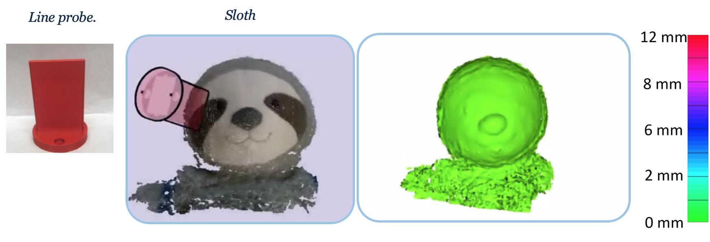

# Deformable-Modeling
Construct models of deformable objects using force-probe contacting and learning algorithm.

TODO
{:height="100%" width="100%"}

## System Overview


## Getting started
### Requirements

  * Hardware:

  * - UR5 (with force sensors)
    - A computer with a dedicated GPU(recommended)
    - Intel RealSense Camera SR300
    - Probe (can be any type)

  * OS:  Ubuntu 16.04

  * Environment:

    - Python 2.7 / Python 3.5
    - UR API
    - Klamp't
    - librealsense & python API
    - open3d
    - numpy

### Installation

Simply git clone the project and check all the dependent libraries.

### Calibration
First, do camera calibration to make the system work correctly. You can do all when connecting the robot.
```
cd experiment
python calibration_testing.py
```
or
```
cd utils
python calibration_calculation.py
python generate_marker_transform_color.py
```
then connect robot
```
python take_calibration_pictures
```

### Executing
simply run
```
python main.py --process [process-name]
```
process can be physical mode or debugging mode in simulation.

**or (recommend)**

check`config.py`, set `self.use_mkdir_exp = True` , then 

```
python main.py --process debugging --step y --probe point 
```

## Step Mode

In step mode, it will be easier to debug and make sure the robot works right.

*note: when first power on ur5, need to swich control mode local then remote.*

`calibration_testing`:Doing the calibration first.

`run_collection_PCD(config)`:Robot move around the object and take pictures of it. Note that if need to chang the camera height and num of photos, need to change both `config.py`and `run_collection_PCD()`

`run_collection_process_PCD(config)`:This process clean the pcd collected and speed up saving with `.npy`

`merge_pcd(config)`:Use Kris Labrary's merge function and ICP method to fix the pcds.

`run_convert_ply(config)`:Simple format convertor.

`run_calculation(config)`:Process the final pcd, including cleaning, sorting, down sampling and selecting.

`run_poking(config)`:Robot acting, probe types include ellipse, point and line. 

## Data Framwork

Point: (point, color, normal, theta, curvature)

Poke: (force, torque, displacement)

## Version

- 2019.07.16 first version.
- 2019.07.19 add line probe mode, add transform from probe to EE, fix unit vector bug.
- 2019.07.21 add duplicates removing, collision detection, and fix point cloud order.
- 2019.07.23 change line poking process: first reconstruct a probe list then poke. fix some vis bugs.
- 2019.07.24 speed up getting pcd, test all process in physical, update data format, add future folder (2 camera in thread)
- 2019.08.13 update the final version and data set.
- 2020.07.02 TODO
